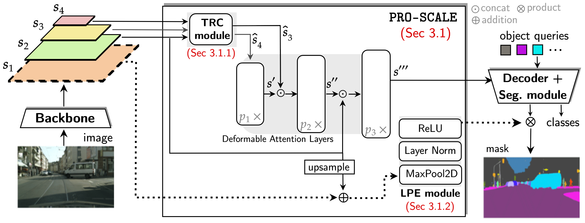

<div align="center">

<h1>Progressive Token Length Scaling in Transformer Encoders <br> for Efficient Universal Segmentation<br> (official implementation) </h1>

<div>
    <a href='https://abhishekaich27.github.io/' target='_blank'>Abhishek Aich</a>&emsp;
    <a href='https://yuminsuh.github.io/' target='_blank'>Yumin Suh</a>&emsp;
    <a href='https://samschulter.github.io/' target='_blank'>Samuel Schulter</a>&emsp;
    <a href='https://cseweb.ucsd.edu/~mkchandraker/' target='_blank'>Manmohan Chandraker</a>&emsp;
</div>
<div>
    <a href='https://www.nec-labs.com/' target='_blank'>NEC Laboratories, America</a> <br>
</div>
<div>
    <h4 align="center">
        <a href="https://arxiv.org/abs/2404.14657" target='_blank'>
        
        </a>
    </h4>
</div>
</div>


## Key Features
Efficient encoder design to reduce computational cost of Mask2Former models
- **Simple.** Easily pluggable to Mask2Former-style models.
- **Effective.** Flexible in reducing encoder cost by 50-75% with little to no segmentation performance degradation.
- **General.** Evaluatedted with various backbones, pre-trained weights as well as DETR model (DINO).

## Model Framework

<div>
    <h4>
        
    </h4>
</div>


## Installation
- Our project is developed on Mask2Former. Please follow their installation [instructions](https://github.com/facebookresearch/Mask2Former/blob/main/INSTALL.md) as well as dataset instructions. You may also refer to the [requirements.txt](requirements.txt).


## Download pretrained weights
- Create a folder named *pretrained_ckpt* in the root folder using `mkdir pretrained_ckpt`.
- Please use the [analyze_model](https://raw.githubusercontent.com/facebookresearch/Mask2Former/main/tools/analyze_model.py) code from Mask2Former to compute GFLOPs reported in the paper.
- Download [our pretrained weights](https://drive.google.com/drive/folders/1eRMBva17PTl29Ceg_n0cJTXvkBX1tTcx?usp=sharing) and put them in *pretrained_ckpt*. \
Our pretrained weights includes PRO-SCALE (configuration (3,3,3)) based Mask2Former models with coresponding backbone and trained on corresponding dataset: 

| Model Name                   | Backbone  | Dataset        | Config  | PQ (%)        |
|------------------------------|-----------|----------------|-----------|----------------|
| r50_proscale_3_3_3_coco            | Res50     | COCO           |[r50_proscale_3_3_3_coco](configs/res50_proscale_3_3_3_coco.yaml)     | 51.44           |
| swint_proscale_3_3_3_coco          | SWIN-T    | COCO           |[swint_proscale_3_3_3_coco](configs/swint_proscale_3_3_3_coco.yaml)    | 52.88           |

<details>
<summary>
Example run command (please set the dataset and output directory path):
</summary>
  
```bash
DETECTRON2_DATASETS=/path/to/dataset/folder/ python3 test_net.py \
    --num-gpus 1 \
    --eval-only \
    --config-file configs/res50_proscale_3_3_3_coco.yaml \
    MODEL.WEIGHTS pretrained_ckpt/r50_proscale_3_3_3_coco.pth \
    OUTPUT_DIR /path/to/output/folder
```
</details>

## Contact
If you have any questions, don't hesitate to contact me at `aaich001@ucr.edu`. 


## Acknowledgement

This repository was built on top of [Detectron2](https://github.com/facebookresearch/detectron2) and [Mask2Former](https://github.com/facebookresearch/Mask2Former). We thank and acknowledge their effort.


## Citing PRO-SCALE
If you find our work helpful for your research, please consider citing the following BibTeX entry.

```BibTeX
@article{aich2024progressive,
  title={Progressive Token Length Scaling in Transformer Encoders for Efficient Universal Segmentation},
  author={Aich, Abhishek and Suh, Yumin and Schulter, Samuel and Chandraker, Manmohan},
  journal={arXiv preprint arXiv:2404.14657},
  year={2024}
}
```
